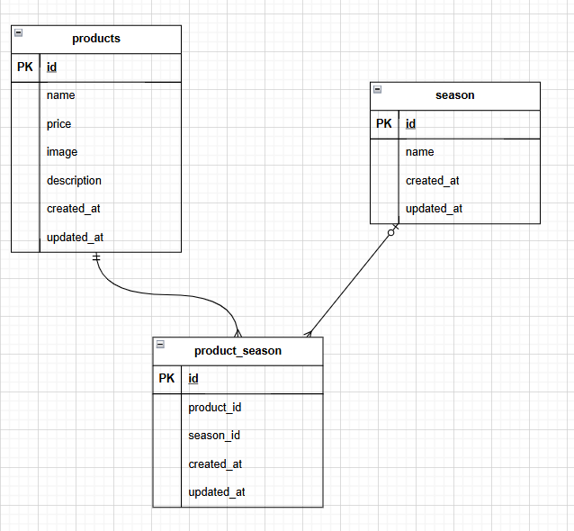

# fruit_store

##　環境構築

Dockerビルド

1.get clone https://github.com/tsugumi-0406/fruit_store
2.docker-compose up -d --build

Laravel 環境構築

1. docker-compose exec php bash
2. composer install
3. .env.example ファイルから.envを作成し、環境変数を変更
4. php artisan key:generate
5. php artisan migrate
6. php artisan db:seed
7. php artisan storage:link

##使用技術
・PHP 8.1
.Laravel 8.83.29
.MySQL 8.0.26

##URL
・開発環境 : http://localhost/
・phpMyAdmin : http://localhost:8080/

##ER図
